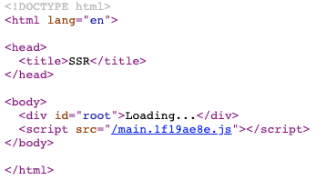

## 들어가는 글
이 글은 리액트(React) 서버 사이드 렌더링(SSR)의 핵심적인 부분을 구현해보는 내용입니다.  [파슬(Parcel) 번들러](https://parceljs.org/)와 [리치 라우터(Reach Router)](https://reach.tech/router)를 사용하는 리액트 앱을 만들어, 라우팅이 포함된 가장 단순한 형태의 SSR을 직접 적용해보도록 하겠습니다.

파슬은 아무런 설정 없이 간편하게 앱을 번들링할 수 있는, [웹팩(webpack)](https://webpack.js.org/)과는 대조적인 성향을 가진 번들러입니다. 리치 라우터는 [리액트 라우터(React Router)](https://reacttraining.com/react-router/web/guides/quick-start)의 제작자가 새로이 만든 라우팅 라이브러리입니다.

## 프로젝트 설정
먼저 일반적인 SPA 형태의 리액트 앱을 만들겠습니다. 가장 중요한 리액트와 번들러인 파슬을 설치합니다.

```shell
$ npm i react react-dom
$ npm i -D parcel-bundler
```

package.json 파일의 `scripts` 필드에 개발 환경을 구동하는 파슬 명령어를 추가합니다.

```json:title=package.json
"scripts": {
  "dev": "parcel index.html",
  ...
}
```

프로젝트의 루트 디렉토리에 파슬의 진입점이 될 index.html 파일을 만듭니다.

```html:title=index.html
<!DOCTYPE html>
<html lang="en">

<head>
  <title>SSR</title>
</head>

<body>
  <div id="root">Loading...</div>
  <script src="./main.js"></script>
</body>

</html>
```

`root`를 아이디로 가진 `<div>`는 우리가 만들 리액트 앱이 자리할 위치입니다. 바로 아래에서 불러오는 main.js 파일의 코드가 실행되면서 그 자리를 채워넣게 될 텐데, 그 전까지는 `Loading…`이라는 글자를 표시하도록 되어있습니다.

이제 최소한의 리액트 코드를 추가할 차례입니다. 프로젝트 루트에 src 디렉토리를 만들고 그 안에 아래와 같이 app.js 파일을 작성합니다.

```jsx:title=src/app.js
import React from 'react'
import ReactDOM from 'react-dom'

const App = () => (
  <div>
    <h1>Home</h1>
  </div>
)

const go = () => {
  ReactDOM.render(<App />, document.getElementById('root'))
}

export { go }
```

위에서 만든 HTML 파일에서 루트 디렉토리의 main.js 파일을 불러오고 있으니, 거기서 방금 만든 `go` 함수를 실행시켜서 리액트 앱을 렌더링하도록 하겠습니다.

```js:title=main.js
import { go } from './src/app'

go()
```

가장 단순한 형태의 React SPA 설정을 완료헀습니다. 이제 터미널에서 `npm run dev`를 쳐서 앱이 실행되는지 확인해볼 수 있습니다.

## 라우팅
SSR 앱으로 바꾸기 전에 최소한의 라우팅 기능을 추가하겠습니다. Reach Router를 설치합니다.

```shell
$ npm i @reach/router
```

홈페이지의 내용을 별도의 Home 컴포넌트로 빼내고, 새로운 about 페이지의 내용이 될 About 컴포넌트를 새로 추가합니다.

```jsx:title=src/Home.js
import React from 'react'

const Home = () => (
  <div>
    <h1>Home</h1>
  </div>
)

export default Home
```

```jsx:title=src/About.js
import React from 'react'

const About = () => (
  <div>
    <h1>About</h1>
  </div>
)

export default About
```

app.js에 리치 라우터를 이용해서 각 페이지로 연결되는 링크와 내용을 표시해줍니다.

```jsx:title=src/app.js
import React from 'react'
import ReactDOM from 'react-dom'
import { Router, Link } from '@reach/router

import Home from './Home'
import About from './About'

const App = () => (
  <div>
    <Link to="/">Home</Link>
    <Link to="/about">About<Link>
    <Router>
      <Home path="/" />
      <About path="/about" />
    </Router>
)

const go = () => {
  ReactDOM.render(<App />, document.getElementById('root'))
}

export { App, go }
```

## SSR
두 개의 페이지로 구성된 SPA를 만들었습니다. 이 상태에서 브라우저의 페이지 소소 보기 기능으로 HTML 파일을 확인해보면 앞서 넣은 Home이나 About 같은 내용은 없고 텅 비어있는 모습을 확인할 수 있습니다. `Loading...`이라는 플레이스홀더를 넣어놓은 index.html 파일 그대로 받고 있죠.



SSR을 위해 서버에서 할 일은 리액트 렌더링의 결과를 문자열, 즉 마크업으로 만든 다음 index.html의 적절한 부분에 삽입하여 HTML 문서를 완성하는 것입니다.

먼저 [익스프레스(Express)](https://expressjs.com/)와, 서버에서 필요한 [바벨(Babel)](https://babeljs.io/) 관련 패키지들을 설치합니다.

```shell
$ npm i express
$ npm i -D @babel/register @babel/preset-env @babel/preset-react rimraf
```

프로젝트 루트에 server 디렉토리를 만들고, 그 안에 index.js와 server.js 파일 두 개를 추가합니다. 실제 앱이 작성될 곳은 server.js 파일이고, index.js에서는 서버 코드가 바벨을 거쳐 실행되도록 설정합니다.

```js:title=server/index.js
require('@babel/register')({
  ignore: [/(node_modules)/],
  presets: ['@babel/preset-env', '@babel/preset-react'],
})
require('./server')
```

```jsx:title=server/server.js
import fs from 'fs'
import express from 'express'
import React from 'react'
import { renderToString } from 'react-dom/server'
import { ServerLocation } from '@reach/router'

import { App } from '../src/app'

const PORT = 1234
// [1]
const MARKUP = fs.readFileSync('index.html').toString().split('Loading...')

const app = express()

// [2]
app.use(express.static('dist'))
app.use((req, res) => {
  // [3]
  const content = renderToString(
    <ServerLocation url={req.url}>
      <App />
    </ServerLocation>
  )

  // [4]
  res.send(MARKUP[0] + content + MARKUP[1])
})

app.listen(PORT, () => {
  console.log('Listening on port ' + PORT)
})
```

위 코드의 1번으로 표시된 부분을 보면 앱을 구동하면서 index.html 파일을 읽어오고 있습니다. 그리고는 그 내용을 문자열로 만든 후 애초에 넣어뒀던 플레이스홀더  `Loading...`을 기준으로 자르고 있는데, 그 이유는 플레이스홀더의 자리에 문자열로 반환된 리액트 렌더링의 결과물을 끼워넣기 위해서입니다.

2번 줄에서는 SPA의 동작을 그대로 가져가도록 빌드된 리소스를 서빙하고 있습니다.

3번 줄에서부터 실제로 리액트 컴포넌트를 서버에서 렌더링하고 있습니다. `renderToString` 함수를 이용해서 우리가 작성한 `<App>` 컴포넌트를  문자열로 렌더링하고, 요청 URL에 따라 적절한 내용을 렌더링하도록 리치 라우터의 `<ServerLocation>` 컴포넌트를 이용하고 있습니다.

4번 줄에서는 문자열로 반환된 결과물을 미리 읽어온 index.html 내용 중간에 끼워넣어 HTML 문서를 완성한 후 클라이언트에게 응답을 보내고 있습니다.

마지막으로 app.js에서 `render` 대신 `hydrate`를 사용하도록 수정합니다. `hydrate`는 `render`와 유사하지만 앱이 서버에서 렌더링된 경우에 사용되며, 이미 완성된 마크업에 이벤트 리스너를 붙이는 등 시동하는 역할을 합니다.

```jsx:title=src/app.js
ReactDOM.hydrate(<App />, document.getElementById('root'))
```

이제 package.json에 빌드 후 노드 서버를 실행하도록 스크립트를 추가합니다.

```json:title=package.json
"scripts": {
  "start": "rimraf dist && parcel build main.js && node server",
  ...
```

이제 서버에서 렌더링된 리액트 앱을 실행해 볼 수 있습니다. `npm start`로 실행 후 페이지 소스를 보면 더이상 텅 빈 HTML 문서가 아닌 것을 확인할 수 있습니다.


## 스트림(Stream)
리액트 버전 16부터 스트림(Stream) 렌더링을 지원합니다. 덕분에 문서 전체가 완성되기 전에 응답의 일부를 보내기 시작하고 브라우저는 이를 순차적으로 렌더링할 수 있습니다.

```jsx:title=server/server.js
import fs from 'fs'
import express from 'express'
import React from 'react'
import { renderToNodeStream } from 'react-dom/server'
import { ServerLocation } from '@reach/router'

import { App } from '../src/app'

const PORT = 1234
const MARKUP = fs.readFileSync('index.html').toString().split('Loading...')

const app = express()

app.use(express.static('dist'))
app.use((req, res) => {
  res.write(MARKUP[0])

  const content = renderToNodeStream(
    <ServerLocation url={req.url}>
      <App />
    </ServerLocation>
  )

  content.pipe(res, { end: false })
  content.on('end', () => {
    res.write(MARKUP[1])
    res.end()
  })
})

app.listen(PORT, () => {
  console.log('Listening on port ' + PORT)
})
```

## 나가는 글
SSR을 제대로 하는 것은 어렵습니다. 한 코드가 두 가지 환경에서 실행된다는 것만으로도 충분히 큰 부담이고, 거기에 스타일링 이슈 하나만 추가되도 문제가 커지기 시작하죠. 상용 프로젝트에서 사용할 수 있는 Next.js 같은 프레임워크가 있어서 다행입니다. 이 글을 통해서는 프레임워크에 가려 잘 보이지 않았던 SSR의 핵심적인 부분을 간추려서 구현해보았습니다. 마지막으로 요약하자면, 서버는 `renderToString`이나 `renderToNodeStream`을 이용해서 완성된 HTML 문서를 만들어 보내고, 클라이언트는 `render` 대신 `hydrate`로 그 문서의 마크업을 재활용해 리액트 앱에 다시 시동을 거는 과정이 있었습니다.